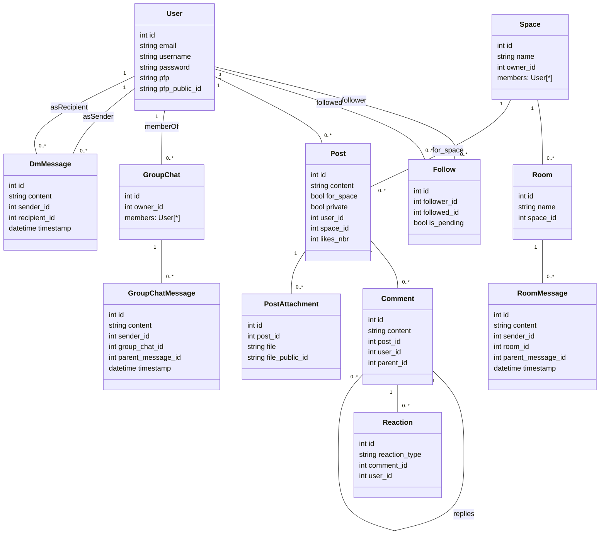

# SocMel Core Class Diagram

```mermaid
classDiagram
  class User {
    int id
    string email
    string username
    string password
    string pfp
    string pfp_public_id
  }

  class Follow {
    int id
    int follower_id
    int followed_id
    bool is_pending
  }

  class Space {
    int id
    string name
    int owner_id
    members: User[*]
  }

  class Room {
    int id
    string name
    int space_id
  }

  class Post {
    int id
    string content
    bool for_space
    bool private
    int user_id
    int space_id
    int likes_nbr
  }

  class Comment {
    int id
    string content
    int post_id
    int user_id
    int parent_id
  }

  class Reaction {
    int id
    string reaction_type
    int comment_id
    int user_id
  }

  class PostAttachment {
    int id
    int post_id
    string file
    string file_public_id
  }

  class GroupChat {
    int id
    int owner_id
    members: User[*]
  }

  class DmMessage {
    int id
    string content
    int sender_id
    int recipient_id
    datetime timestamp
  }

  class GroupChatMessage {
    int id
    string content
    int sender_id
    int group_chat_id
    int parent_message_id
    datetime timestamp
  }

  class RoomMessage {
    int id
    string content
    int sender_id
    int room_id
    int parent_message_id
    datetime timestamp
  }

  User "1" -- "0..*" Follow : follower
  User "1" -- "0..*" Follow : followed
  Space "1" -- "0..*" Room
  Space "1" -- "0..*" Post : for_space
  User "1" -- "0..*" Post
  Post "1" -- "0..*" Comment
  Comment "1" -- "0..*" Comment : replies
  Comment "1" -- "0..*" Reaction
  Post "1" -- "0..*" PostAttachment
  GroupChat "1" -- "0..*" GroupChatMessage
  User "1" -- "0..*" GroupChat : memberOf
  Room "1" -- "0..*" RoomMessage
  User "1" -- "0..*" DmMessage : asSender
  User "1" -- "0..*" DmMessage : asRecipient
```
