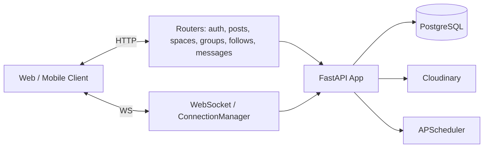

# SocMel Component Diagram

```mermaid
flowchart LR
  Client[Web / Mobile Client]
  FastAPI[FastAPI App]
  Routers[Routers: auth, posts, spaces, groups, follows, messages]
  WS[WebSocket / ConnectionManager]
  DB[(PostgreSQL)]
  Cloudinary[Cloudinary]
  APS[APScheduler]

  Client <-- HTTP --> Routers
  Client <-- WS --> WS
  Routers --> FastAPI
  WS --> FastAPI
  FastAPI --> DB
  FastAPI --> Cloudinary
  FastAPI --> APS
```
