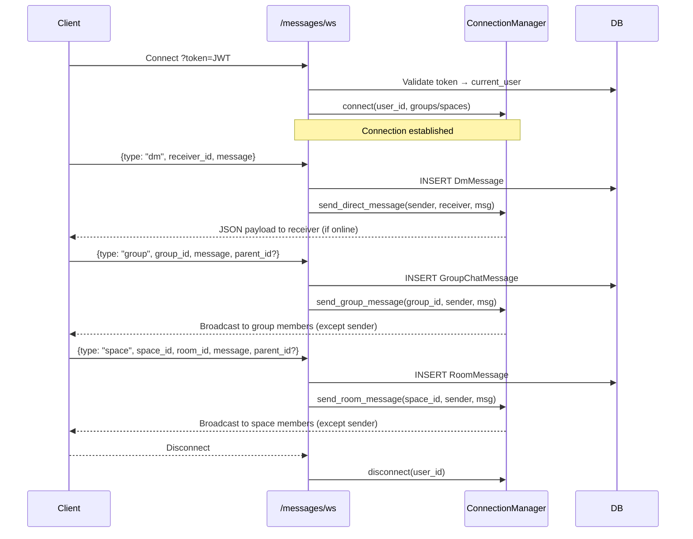

# SocMel WebSocket Message Flow

```mermaid
sequenceDiagram
  participant C as Client
  participant WS as /messages/ws
  participant CM as ConnectionManager
  participant DB as DB

  C->>WS: Connect ?token=JWT
  WS->>DB: Validate token → current_user
  WS->>CM: connect(user_id, groups/spaces)
  Note over WS,CM: Connection established

  C->>WS: {type: "dm", receiver_id, message}
  WS->>DB: INSERT DmMessage
  WS->>CM: send_direct_message(sender, receiver, msg)
  CM-->>C: JSON payload to receiver (if online)

  C->>WS: {type: "group", group_id, message, parent_id?}
  WS->>DB: INSERT GroupChatMessage
  WS->>CM: send_group_message(group_id, sender, msg)
  CM-->>C: Broadcast to group members (except sender)

  C->>WS: {type: "space", space_id, room_id, message, parent_id?}
  WS->>DB: INSERT RoomMessage
  WS->>CM: send_room_message(space_id, sender, msg)
  CM-->>C: Broadcast to space members (except sender)

  C-->>WS: Disconnect
  WS->>CM: disconnect(user_id)
```
